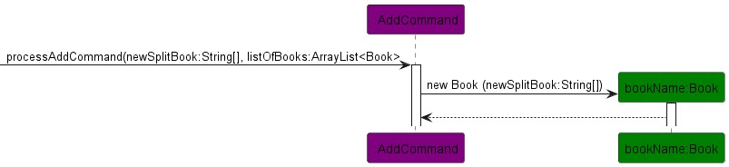

# Developer Guide

## Acknowledgements

{list here sources of all reused/adapted ideas, code, documentation, and third-party libraries -- include links to the original source as well}

## Design & implementation
## Design
### Architecture

The architecture given above explains the high-level design of BookMarked application.

Given below is quick overview of main components and how they interact with each other.

#### Main components of the architecture
- `Ui`: The UI of the app shown in CLI
- `Main`: The main code that handles the running of program 
- `Storage`: Handles write and read data to and from txt file
- `Parser`: Handles user input and execute the necessary command
- `Command`: Handles functionality of the app
- `Book`: Books in the library

### Ui Component

### Storage Component
BookMarked application is using txt file as its main storage for all the data.
All data related to books are stored in `book.txt`.

At the start of running the application, `readFileStorage` is called to get the data saved 
from the previous runs of the application.

Whenever any there's any changes in the data for books during the running of the application, 
`writeBookToTxt` is called. Data stored in will be converted to formatted string and written 
to the txt file, `book.txt`.

### Parser Component

### Command Component
Bookmarked is an application that allows new books bought to be added to the inventory
Discarded books can also be deleted through the command delete BOOK_NUMBER
- Add book:
- The add book function allows for new book to be added into the inventory
- It is processed through the AddCommand class
- The handleCommand function splits the user command into the add and description of book
- processAddCommand adds the new book into the bottom of the list based on the current number of books

### Book Component

## Product scope
### Target user profile

{Describe the target user profile}

### Value proposition

{Describe the value proposition: what problem does it solve?}

## User Stories

|Version| As a ... | I want to ... | So that I can ...|
|--------|----------|---------------|------------------|
|v1.0|new user|see usage instructions|refer to them when I forget how to use the application|
|v2.0|user|find a to-do item by name|locate a to-do without having to go through the entire list|

## Non-Functional Requirements

{Give non-functional requirements}

## Glossary

* *glossary item* - Definition

## Instructions for manual testing

{Give instructions on how to do a manual product testing e.g., how to load sample data to be used for testing}
