# BookMarked User Guide 📖

## Introduction

BookMarked is a desktop application designed specifically for librarians to streamline
the management of library inventory and borrower records. Optimized for use via a
Command Line Interface (CLI) while incorporating a Graphical User Interface (GUI),
BookMarked offers efficiency and speed in managing tasks. If you can type fast,
BookMarked enables you to perform inventory management tasks more swiftly than
traditional GUI-based applications.

## Table of Contents
Command Summary

* Quick Start
* Features
  * Viewing help : `help`
  * Adding a book : `add`
  * Deleting a book : `delete`
  * Viewing books : `list`
  * Editing a book : `edit`
  * borrowing book : `borrow`
  * extending borrowed book : `extend`
  * returning borrowed book : `return`
  * finding books : `find`
  * exiting application : `bye`
* FAQ
* Command Summary

## Quick Start

1. Ensure that you have installed Java `11` on your computer.
2. Download the latest version of `BookMarked.jar` from [here](https://github.com/AY2324S2-CS2113-W13-4/tp/releases).
3. Copy the file to your desired folder for use as a _home folder_.
4. Open a command terminal, `cd` into the folder you put the jar file in, 
   and run the command `java -jar BookMarked.jar`. A command line display 
   similar to the one shown below will appear:
    ```
    _______________________________________________________________________________
    _______________________________________________________________________________
    
    Welcome to BookMarked, a one-stop app for all your librarian needs!
    To get started, you can type 'help' to see a list of commands!
    
    _______________________________________________________________________________
    _______________________________________________________________________________
    ```
5. Type some commands in the terminal and press Enter to execute it. 

    Here are some commands you can try:
    * `add book`
    * `list /sortby default`
    * `borrow book /by human`
    * `bye`
- **NOTE: all commands and arguments are case sensitive.**
- **Furthermore, all commands are space sensitive as well***
  - **However, all arguments are NOT space sensitive, meaning that if an argument was inputted as:
    `"           man"`, it would register as `"man"`.**
   
6. You can refer to the features below for the details of each command.

## Features
### Viewing all possible features: `help`
Lists out all available commands and their format.

Format: `help`


Examples: 
* `help`

### Adding a book to inventory: `add`
Adds a new book to the library's inventory.

Format: `add NAME_OF_BOOK (optional)/quantity NUMBER_OF_COPIES`

* If the /quantity argument is not inputted, the default number of copies is 1
* A maximum of 1000 copies of the books can be registered in total in the library.
* To add more copies of a book that already exists, simply type in the name of the book
  you wish to add, and type in the command per normal.
* For book titles, you cannot input titles containing special characters, or titles that are only
  numbers (eg. 7, 193, etc).

Example of usage:

`add The Book Thief`

* To add more copies of The Book Thief after it has already been added:
  `add The Book Thief` again.

`add The Hunger Games /quantity 50`

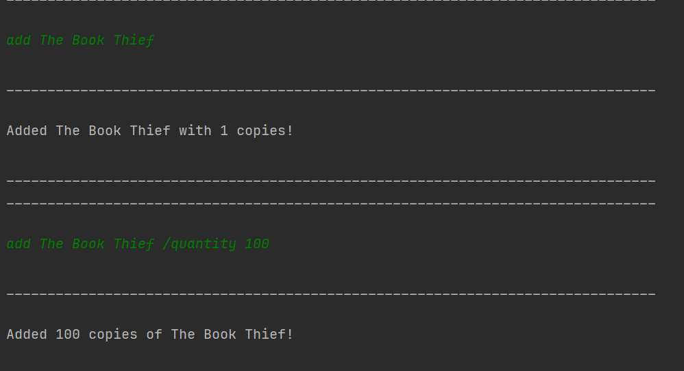


### Deleting books in the library: `delete`
Removes a book from the library's inventory based on its index in the list.

Format: `delete INDEX (optional)/quantity NUMBER_OF_COPIES`

* `INDEX` is the position number of the book in the list as shown by the default `list` command
  which is `list /sortby default`.
* A maximum of 1000 copies can be stored, and thus deleted from the library's inventory.
* Delete does not affect the books currently being borrowed by users, only those currently
   available in the library's inventory.
* To completely remove a book from the library, please ensure that all books are returned
  to the library before deleting all copies in the inventory.

Example of usage:

`delete 1`

`delete 3 /quantity 100`

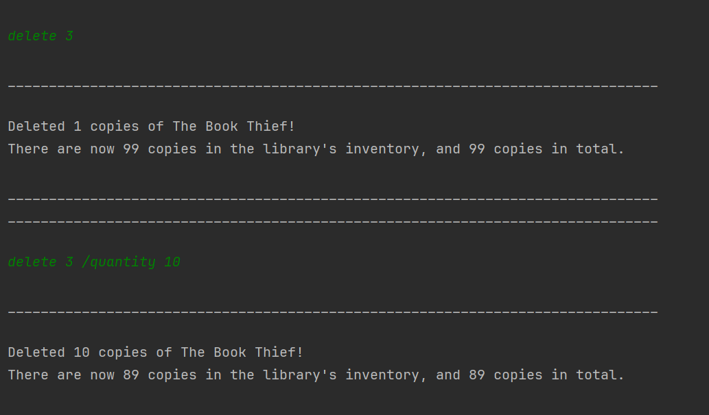

### Viewing books in the library: `list`
* Provides a list of books or users in the library.

Format: `list /sortby ARGUMENT`

There are four ways of sorting the list:
1. **Default**

   Format: `list /sortby default`

* Lists the list of books by the order which the first copy
of the book was added in regardless of their borrowed status or return date
* Outputs each book followed by the number of copies of each book in the inventory 
which is the number of books not borrowed, followed by the number of copies of each
book that has been borrowed.
* When a new book is added, if a book of the same title has not already been added, the
new book adds itself into the bottom of the book list
* If the new book being added already has a book of the same title which was added, the
number of books corresponding to the book title updates itself and adds a copy
* Eg. if `booka` was first added into the inventory, followed by `book b`,
the list of books will be as follows:
```
1. booka. Number of books in inventory: 1. Number of books borrowed: 0.
2. bookb. Number of books in inventory: 1. Number of books borrowed: 0.
```

2. **Alphabetical order**

   Format: `list /sortby alphabetical`

* Lists the list of books in the library in alphabetical order, in the same format as the `default` sort.
* 'Spaces' (" ") preceed any alphabet, and uppercase letters preceed lowercase letters.
* Eg. `book c` precedes `booka`, and `Bookc` preceds `bookc`.
* Eg. if the list contains : `booka`, `bookb`, `book c`, when sortby alphabetical is called,
the list is as follows: 
```
1. book c. Number of books in inventory: 1. Number of books borrowed: 0.
2. booka. Number of books in inventory: 1. Number of books borrowed: 0.
3. bookb. Number of books in inventory: 1. Number of books borrowed: 0. 
```
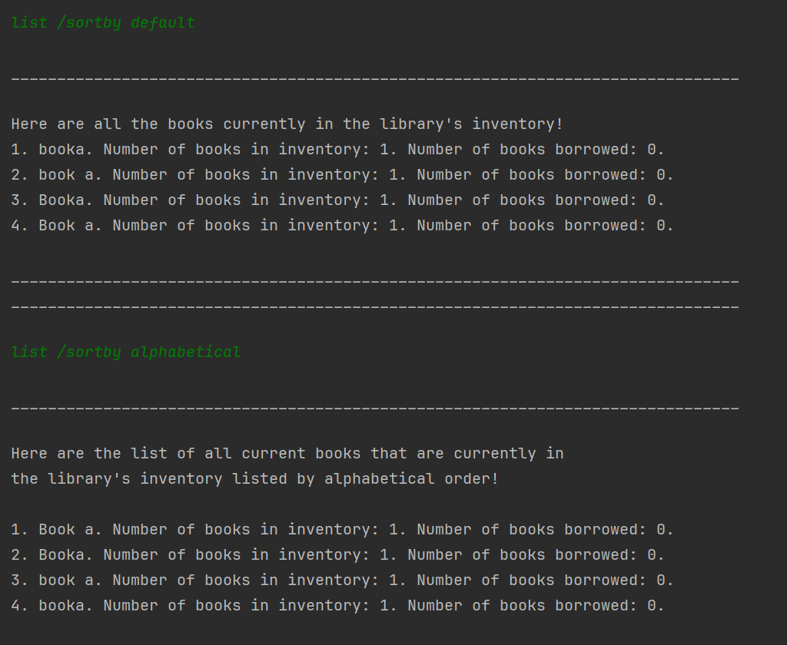

3. **By user**

    Format: `list /sortby user`

* Listing all users along with their borrowed books
* When a user borrows a book, the user is added to the user list
* Similar to list /sortby default, the users are listed according to their order
of being added to the user list. This is regardless of their borrow or return date
* The list of users only contain current users : meaning the list of users
are only those that currently have books borrowed.
* When a user returns all his books, he is deleted from the user list
hence will not be reflected
* Under each user, the list of books currently borrowed by the user is shown
* The list of borrowed books of each user is sorted by the order of the book being
added to the user's book list.
  * For example: if the user borrows 2 books, `booka` and `bookb`
  but borrows `booka` first, `booka` will be item 1 on the list
* The output is as follows:
```
* User: tom
* Borrowed Books:
* 1. book c, Borrowed on: 2024-04-14, Return by: 2024-05-05
* 2. book a, Borrowed on: 2024-04-15, Return by: 2024-04-29
* User: mary
* Borrowed Books:
* 1. book d, Borrowed on: 2024-04-14, Return by: 2024-04-28
```
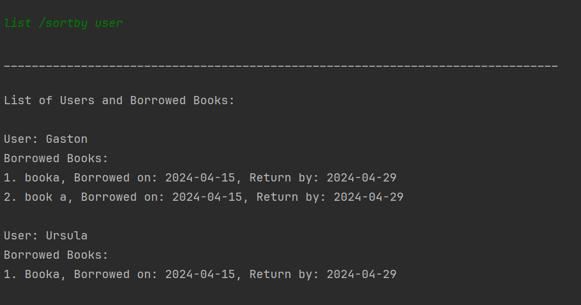


### Editing books in the library: `edit`
Allows for the modification of the details of an existing book in the library. 
This command currently supports editing the title of a book.

Format:

To edit by book index : `edit INDEX /title NEW_TITLE`

* The `INDEX` of the book is based on the output shown in the default list function and 
  should be the available `INDEX` in the library list.
* The new title of the book is specified in `NEW_TITLE`, and can be in more than 1 word.
* The title of the book, `NEW_TITLE`, is case-sensitive, and differences in case will
  refer to a different book.
* The `/title` tag is compulsory to put.

To edit by book title : `edit CURRENT_BOOK_TITLE /title NEW_TITLE`

* The current book title is specified in `CURRENT_BOOK_TITLE` and **must** be **exactly** specified as
  the actual current book title and is case-sensitive.
* The new title of the book is case-sensitive, specified in `NEW_TITLE`, and can be in more 
  than 1 word.
* The `/title` tag is compulsory to put.

Example of usage:
* `edit 1 /title The Book Thief`
* `edit new /title The New Beginning`
  
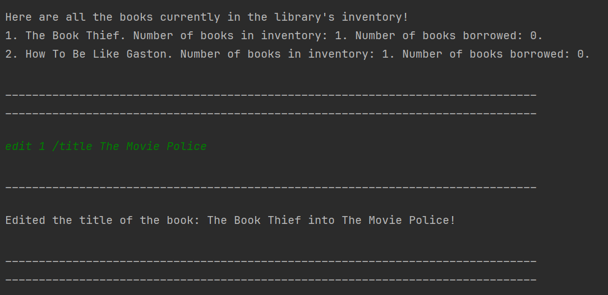
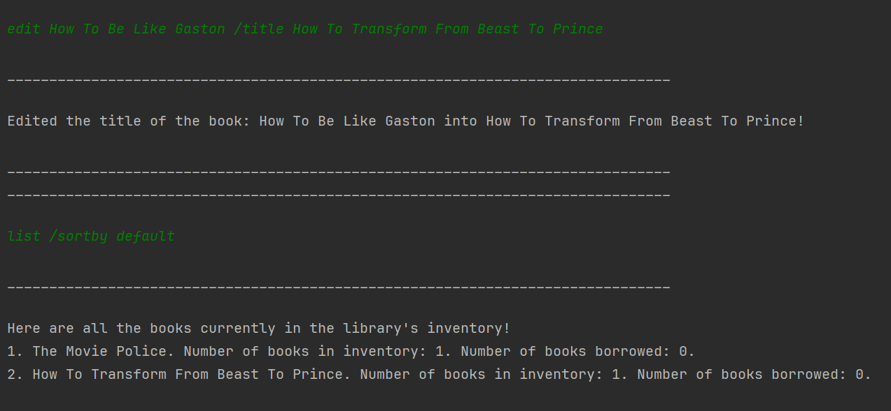

### Borrowing books in the library: `borrow`
Allows a user to borrow a book from the library's inventory if it is available. 
The book will be marked as borrowed, and a due date will be set for its return.
The return date is set at a default of two weeks from the date of borrowing.

Format: 

To borrow by book title : `borrow BOOK_NAME /by USER_NAME`

To borrow by book index : `borrow INDEX /by USER_NAME`

* The `INDEX` of the book can be seen using the default list command which is `list /sortby default`.

Note :

* Users do not need to be pre-added. They can be added directly when using the borrow command. 
* Each user can borrow multiple books, but they can only borrow one book of each title. For example, if 'Tom' has 
  borrowed one copy of 'The Book Thief', the user cannot borrow a second copy of 'The Book Thief', even if there is more than 
  one copy of 'The Book Thief' available in the inventory. 
* The username cannot any contain special characters.
  borrowed one copy of 'The Book Thief', the user cannot borrow a second copy of 'The Book Thief', even if there is 
  more than one copy of 'The Book Thief' available in the inventory. 
* If the specified book is not available for borrowing, or if there are no available copies left in the inventory,
  an appropriate message will be displayed.
* If there is more than 1 quantity of a book title available and two users want to borrow the book, the commands 
  must be typed separately. The command will only take the `USER_NAME` after the first `\by`.


Examples of usage:

Borrow by book title : `borrow The Book Thief /by Tom`

Borrow by book index : `borrow 1 /by Tom`

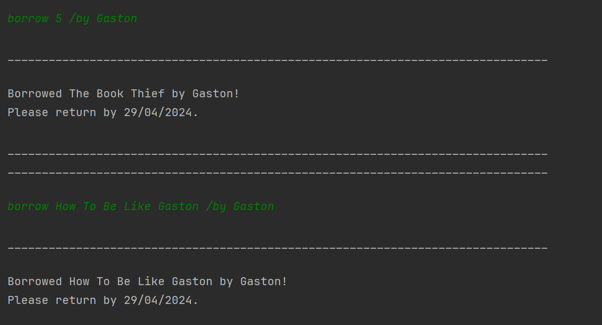

### Extending borrowed books in the library: `extend`
Allows a user to extend the borrowing period of a book they have already borrowed. 
The extension is for a predefined period of 7 days.

Format: 

To extend by book title : `extend BOOK_NAME /by USER_NAME`


To extend by book index : `extend INDEX /by USER_NAME`

* The `INDEX` of the book can be seen using the default list command which is `list /sortby default`.

Note:

* The due dates of books can only be extended, if they are already borrowed.
* The system will output a message confirming the successful extension of the borrowing period, 
  along with the new due date.


Examples of usage:

Extend by book title : `extend The Book Thief /by Tom`

Extend by book index : `extend 1 /by Tom`

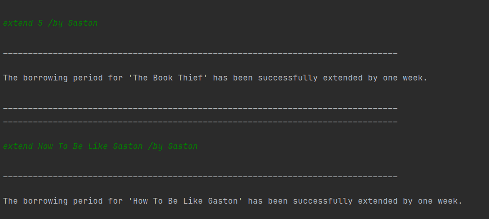


### Returning borrowed books in the library: `return`
Allows a user to return a book they have borrowed from the library's inventory, marking it as not borrowed.

Format: 

To return by book title : `return BOOK_NAME /by USER_NAME`

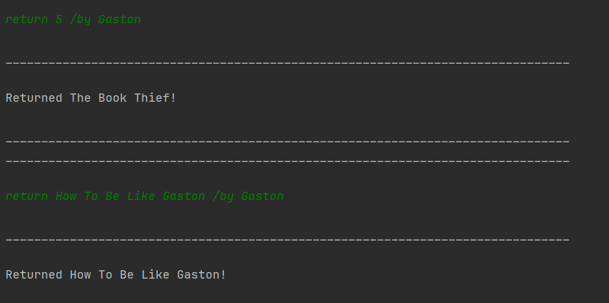

To return by book index : `return INDEX /by USER_NAME`

* The `INDEX` of the book can be seen using the default list command which is `list /sortby default`.

Note : 

* Only books that have been borrowed by the user can be returned.
* The system will output a message confirming the successful return of the book.
* If the book being returned is overdue, system outputs a message to alert users of the overdue.


Examples of usage:

Return by book title : `return The Book Thief /by Tom`

Return by book index : `return 1 /by Tom`


### Finding books or users in the library: `find`
Enables users to search for books in the library's inventory that match a given keyword.
Enables users to search for those who borrowed books

To search for books:
Format: `find /by book KEYWORD`

* 'KEYWORD' is the word or phrase you want to search for in the titles of the books in the library.
* The command lists all books that contain the keyword in their title.
* Only books with the keyword in their title will be reflected. If there are no books containing the keyword currently
output returns no book with matching keyword

Example of usage:

* `find /by book Thief`

To search for users:
Format: `find /by user USERNAME`

* 'USERNAME' is the name of the user you want to find.
* The command lists all users that contain the username in their name along with their borrowed
books, borrowed on date, return date and return status whether it is overdue
* If there is more than one user containing the username, the first user is printed out
with her corresponding books, followed by the next user
* If there is no user containing the username, the output prints user not found

Example of usage:
* `find /by user Tom`

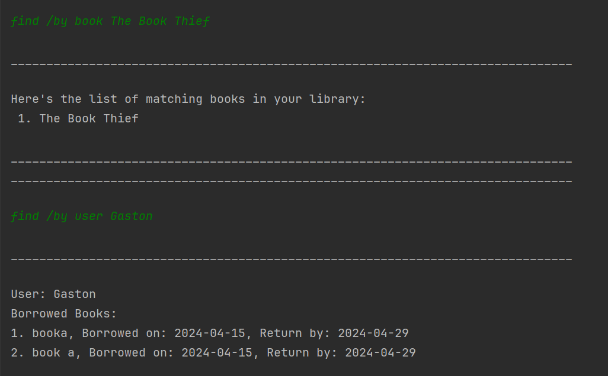

### Exiting application: `bye`
Safely closes the BookMarked application.

Format: `bye`

Example of usage:
* `bye`

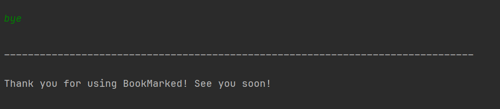

### Storage
There are 2 txt files created and updated when using BookMarked application, which
are book.txt and user.txt. These 2 files saved the data related to books and users 
of the library in local hard disk after any command that modify the data. Exceptions,
such as:
* duplicate name of books or user,
* difference in books borrowed by user and in inventory,
* wrong formatted line in txt,
* invalid borrow date and return due date,

are handled.


## FAQ
> **Q**: How do I transfer my data to another computer?
>
> **A**: Copy the /book.txt file to another computer and paste it in the
> same folder inside bookMarked.jar

> **Q**: Can I access the task I previously added when I restart the application?
>
> **A**: Yes, all data are saved in local hard disk and will be reloaded every time
> the application is restarted

## Command Summary


| Action                                | Command Format                                | Example                   |
|---------------------------------------|-----------------------------------------------|---------------------------|
| view all commands and its usage       | help                                          | help                      |
| add 1 book                            | add BOOK_TITLE                                | add abc                   |
| add specific number of books          | add BOOK_TITLE /quantity NUMBER_OF_COPIES     | add abc /quantity 5       |
| borrow a book by book index in list   | borrow INDEX /by USER_NAME                    | borrow 1 /by human        |
| borrow a book by book title           | borrow BOOK_TITLE /by USER_NAME               | borrow abc /by human      |
| return a book by book index in list   | return INDEX /by USER_NAME                    | return 1 /by human        |
| return a book by book title           | return BOOK_TITLE /by USER_NAME               | return abc /by human      |
| extend return due date by book index  | extend INDEX                                  | extend 1                  |
| extend return due date by book title  | extend BOOK_TITLE                             | extend abc                |
| edit book title by book index in list | edit INDEX /title BOOK_TITLE                  | edit 1 /title def         |
| edit book title by current book title | edit CURRENT_BOOK_TITLE /title NEW_BOOK_TITLE | edit abc /title def       |
| delete a book                         | delete INDEX                                  | delete 1                  |
| list all books                        | list /sortby default                          | list /sortby default      |
| list all books alphabetically         | list /sortby alphabetical                     | list /sortby alphabetical |
| list users who borrowed books         | list /sortby user                             | list /sortby user         |
| find a book                           | find /by book FIND_KEYWORD                    | find /by book abc         |
| find a user                           | find /by user FIND_KEYWORD                    | find /by user human       |

